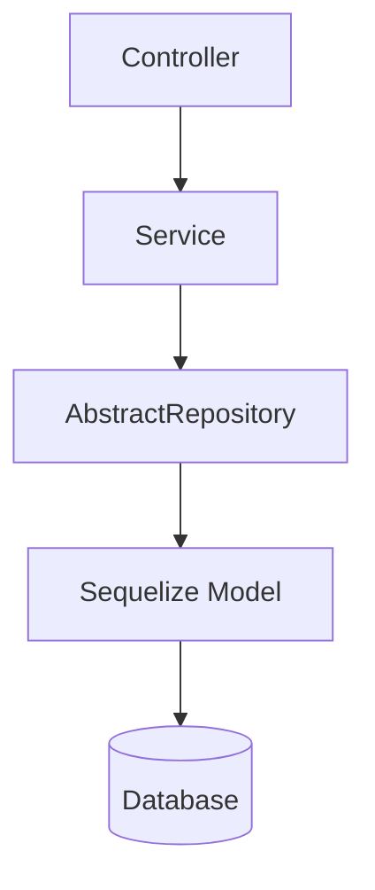

# Abstract Sequelize Repository for NestJS

TypeORM-style generic repository support for NestJS projects that use Sequelize.

If you are already using `sequelize-typescript`, this package helps you replace repetitive CRUD code with a reusable repository base that gives you:

- Strong TypeScript typing
- Generic CRUD helpers
- Pagination support
- Soft delete support
- Transaction helpers
- NestJS-friendly dependency injection
- Optional logger injection
- Extensible base classes for custom behavior
- `@InjectRepository()` helper for model-based injection

## Why this exists

Most teams using Sequelize end up writing the same repository code over and over:

```ts
await User.findAll({ where: { active: true } })
await User.findByPk(id)
await User.create(dto)
```

This package turns that into a reusable repository layer:

```ts
@Injectable()
export class UserRepository extends AbstractRepository<User> {
  constructor(@InjectModel(User) userModel: typeof User) {
    super(userModel);
  }
}

const users = await userRepository.findAll({ active: true });
```

Use it when you want:

- less boilerplate
- a consistent repository API
- better testability
- centralized pagination and soft delete behavior
- a cleaner abstraction over Sequelize models
- direct injection of repositories by model without writing a custom repository class

## Features

| Feature | What you get |
| --- | --- |
| Generic repository base | Extend `AbstractRepository` for each model |
| Strong typing | Works with custom DTOs or Sequelize creation attributes |
| CRUD helpers | `create`, `insert`, `insertMany`, `find`, `update`, and delete helpers |
| Pagination | `findAllPaginated()` and `calculateOffset()` |
| Soft delete support | Works with `paranoid: true`, including restore helpers |
| Transactions | `transaction()` for scoped transactional work |
| Logger injection | Pass a NestJS logger for internal logging |
| Extensibility | Override methods when you need custom validation or hooks |
| Repository injection | Use `@InjectRepository(Model)` and a generated provider |

## Quick Start

### Install

```bash
npm install @nestlize/repository
# or
yarn add @nestlize/repository
# or
pnpm add @nestlize/repository
```

### 1. Define a model

[`BaseModel`](src/base.model.ts) extends Sequelize's `Model` and adds timestamps.

```ts
import { BaseModel } from '@nestlize/repository'

@Table({ tableName: 'users', paranoid: true })
export class User extends BaseModel<User> {
  @PrimaryKey
  @Default(DataType.UUIDV4)
  @Column
  user_id: string;

  @Column
  name: string;

  @Column
  email: string;
}
```

### 2. Create a repository

```ts
import { AbstractRepository } from '@nestlize/repository'

@Injectable()
export class UserRepository extends AbstractRepository<User> {
  constructor(@InjectModel(User) userModel: typeof User) {
    super(userModel);
  }
}
```

### 3. Use it in a service

```ts
@Injectable()
export class UserService {
  constructor(private readonly users: UserRepository) {}

  async createUser(dto: CreateUserDto) {
    return this.users.create(dto);
  }

  async listActiveUsers() {
    return this.users.findAll({ active: true });
  }

  async getPage(page: number) {
    return this.users.findAllPaginated({
      limit: 20,
      page,
      query: { active: true },
    });
  }
}
```

### 4. Inject a repository directly

If you do not want a custom repository class for every model, you can inject a model-backed repository with `@InjectRepository()` and a provider created from the model.

```ts
import { InjectRepository, Nestlize } from '@nestlize/repository'

@Module({
  providers: [
    UserService,
    Nestlize.getProvider(User),
  ],
})
export class UserModule {}
```

```ts
@Injectable()
export class UserService {
  constructor(
    @InjectRepository(User)
    private readonly users: IRepository<User>,
  ) {}

  async listActiveUsers() {
    return this.users.findAll({ active: true });
  }
}
```

This keeps the ergonomic NestJS injection style while avoiding one repository class per model.

## How it fits together



## Before / After

| Without this library | With this library |
| --- | --- |
| Repeated CRUD code per model | Reusable base repository |
| Manual pagination logic | `findAllPaginated()` |
| Manual offset calculation | `calculateOffset()` |
| Ad hoc soft delete handling | Built-in restore/delete helpers |
| Transaction logic scattered around services | Centralized transaction helper |

## API Overview

All methods return Promises.

| Method | Parameters | Description |
| --- | --- | --- |
| `create(dto, options?)` | `dto: CreationAttributes<TModel>`, `options?: CreateOptions<TModel>` | Create a new record |
| `insert(dto, options?)` | Same as `create` | Alias for `create` |
| `insertMany(dtos, options?)` | `dtos: CreationAttributes<TModel>[]`, `options?: BulkCreateOptions<Attributes<TModel>>` | Create multiple records |
| `findByPk(primaryKey, options?)` | `primaryKey: string \| number`, `options?: Omit<FindOptions, 'where'>` | Find a record by primary key |
| `findOne(query?, options?)` | `query?: WhereOptions`, `options?: Omit<FindOptions, 'where'>` | Find a single record by query |
| `findAll(query?, options?)` | `query?: WhereOptions`, `options?: Omit<FindOptions, 'where'>` | Find all matching records |
| `findAllPaginated(options?)` | `limit?: number`, `offset?: number`, `page?: number`, `query?: WhereOptions`, `options?: Omit<FindAndCountOptions, 'where' \| 'offset' \| 'limit'>` | Find records with pagination and total count |
| `updateByPk(primaryKey, dto, options?)` | `primaryKey: string \| number`, `dto: Partial<Attributes<TModel>>`, `options?: SaveOptions` | Update a record by primary key |
| `delete(query, options?)` | `query?: WhereOptions`, `options?: Omit<DestroyOptions<Attributes<TModel>>, 'where'>` | Soft delete or hard delete records that match a query |
| `restore(query, options?)` | `query?: WhereOptions`, `options?: Omit<RestoreOptions<Attributes<TModel>>, 'where'>` | Restore soft-deleted records that match a query |
| `deleteByPk(primaryKey, options?)` | `primaryKey: string \| number`, `options?: InstanceDestroyOptions` | Delete a record by primary key |
| `restoreByPk(primaryKey, options?)` | `primaryKey: string \| number`, `options?: InstanceRestoreOptions` | Restore a previously soft-deleted record |
| `transaction(runInTransaction)` | `(transaction: Transaction) => Promise<R>` | Execute work in a Sequelize transaction |
| `calculateOffset(limit, page)` | `limit: number`, `page: number` | Calculate page offset |
| `InjectRepository(model)` | `model: ModelCtor<any>` | Decorator for injecting a model-backed repository |
| `Nestlize.getProvider(model)` | `model: ModelCtor<any>` | Creates the NestJS provider for a model-backed repository |

## Pagination

`findAllPaginated()` supports both offset-based and page-based pagination.

```ts
const result = await userRepository.findAllPaginated({
  limit: 20,
  page: 2,
  query: { active: true },
});
```

If you already have an offset:

```ts
const result = await userRepository.findAllPaginated({
  limit: 20,
  offset: 40,
  query: { active: true },
});
```

## Soft Delete

Use Sequelize `paranoid: true` models and the repository will keep restore helpers available.

```ts
await userRepository.deleteByPk(userId);
await userRepository.restoreByPk(userId);
```

## Transactions

```ts
await userRepository.transaction(async (transaction) => {
  await userRepository.insert(
    { name: 'Jane', email: 'jane@example.com' },
    { transaction },
  );
});
```

## Configuration

`AbstractRepository` accepts a logger instance when you need custom logging.

```ts
{
  logger: new MyCustomLogger('UserRepository'),
}
```

## Extending the base class

The repository is designed to be overridden when your model needs custom behavior.

```ts
@Injectable()
export class UserRepository extends AbstractRepository<User> {
  async findActiveUsers() {
    return this.findAll({ active: true });
  }
}
```

## Roadmap

This library currently focuses on the core repository workflow. Some ideas for future expansion:

- specification-style query composition
- async transaction propagation
- cursor pagination
- query builder abstraction
- repository events and hooks
- multi-tenant support
- testing utilities

## Contributing

Contributions are welcome.

If you want to help, look for issues labeled:

- `good first issue`
- `help wanted`
- `documentation`
- `feature request`

## License

MIT © Kiril Yakymchuk
